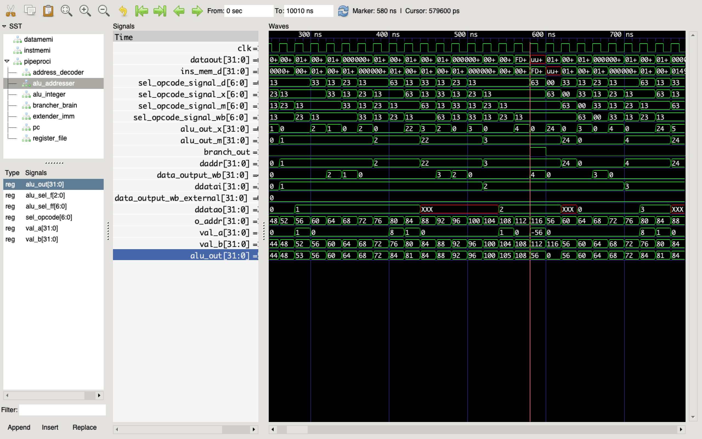

## Processor

## What is a ISA (short)
_A Processor must execute a sequence of instructions, where each instruction performs some primitive operation, such as adding two numbers. An instruction is encoded in binary form as a sequence of 1 or more bytes. The instructions supported by a particular processor and their byte-level encodings are known as its instruction set architecture (ISA). Different “families” of processors, such as Intel IA32 and x86-64, IBM/Freescale Power, and the ARM processor family, have different ISAs. A program compiled for one type of machine will not run on another. On the other hand, there are many dif- ferent models of processors within a single family. Each manufacturer produces processors of ever-growing performance and complexity, but the different models remain compatible at the ISA level. Popular families, such as x86-64, have pro- cessors supplied by multiple manufacturers. Thus, the **ISA provides a conceptual/functional layer of abstraction between compiler writers, who need only know what instructions are permitted and how they are encoded, and processor designers, who must build machines that execute those instructions. (E.Bryant, Computer Systems (2016))**_

## How to build one?
  _Defining an instruction set architecture, such as RISC-V, includes defining the different components of its state, the set of instructions and their encodings, a set of programming conventions, and the handling of exceptional events. So the instruction set is used as a target for our processor implementations._


## CISC vs. RISC

| CISC        | RISC           |
| ------------- |:------------- |
| A large number of instructions| Many fewer instructions—typically less than 100 |
| Variable-size encodings. x86-64 instructions can range from 1 to 15 bytes      |    Fixed-length encodings. Typically all instructions are encoded as 4 bytes. |
| Arithmetic and logical operations can directly manipulate the RAM | Arithmetic and logical operations only use register operands (load/store architecure)      |

And many more....

## Encoding of the Instruction set
The encoding of a Instruction is there, because the Machine (CPU) doesn't understand any text.
So to resolve this the text must be encoded in a specific byte format (in RISC 32 Bit). So: Text -transform-> Byte -Input-> CPU
% TODO

## Decoding of the Instruction set
The decoding plays a role in the CPU to "decode" the byte sequence via an AddressDecode (Demultiplexer). So if
we chunked the byte sequence, the demultiplexer gives those bytes to the other components of the CPU (like PC, ALU, Registerfile, ....)
% TODO


## Further Ideas (possible objective)
Because the RISC-V architecture is flexible (backward -and forwardcompatible) we could extend a subset of one RISV-V
architecture with a subset of Instructions for ML based operations, i.e. [convulutions](https://en.wikipedia.org/wiki/Convolution) for CNNs, .... (Take ideas from the [Paper](ideas/ISA_ML.pdf), see also this [overview](https://dl.acm.org/doi/fullHtml/10.1145/3331469))
% TODO


## ISA RISV-V RV32I


### Integer Computational Instructions:

Integer computational instructions are either encoded as register-immediate operations using the I-type format or as register-register operations using the R-type format.

> _Note: did not include special instruction-set support for overflow checks on integer arithmetic operations in the base instruction set; overflow checks can be implemented in RISC-V branches_


#### Integer Register-Immediate Instructions:
  - ADDI (Add imidiate): sign-extended 12-bit immediate to register rs1 (ADDI rd, rs1, 0)
  - SLTI (set less than immediate): "rd ? if rs1 < signextended immediate : 0;"   
  - ANDI, ORI, XORI (logical operations): perform bitwise OP := AND, OR, XOR; "rd = rs1 OP sign-extended 12-bit immediate"
  - SRLI (logical right shift): zeros are shifted into the upper bits
  - SRAI (arithmetic right shift): the original sign bit is copied into the vacated upper bits
  - SLLI (logical left shift): zeros are shifted into the lower bits 
  - LUI (load upper immediate): used to build 32-bit constants, i.e. places the U-immediate value in the top 20 bits of the destination register rd, filling in the lowest 12 bits with zeros.
  - AUIPC (add upper immediate to pc): is used to build pc-relative addresses
  
#### Integer Register-Register Operations:
  - ADD, SUB: addition of rs1 and rs2; rd = rs1 + rs2; ADD rd rs1 rs2
  - SLT, SLTU (signed, unsigned compares respectively): rd ? if rs1 < rs2 : 0;
  - AND, OR, XOR (perform bitwise logical)
  - SLL, SRL, SRA (logical left, logical right, arithmetic right shifts): value in "rs1 shift rs2"
  - NOP (Instruction) := ADDI x0, x0, 0 --> NOP for Pipeline "Bubbles"


### Control Transfer Instructions:

 #### Unconditional Jumps
  - JAL(jump and link): JAL stores the address of the instruction following the jump (pc+4) into register rd
  - JALR (indirect jump instruction): see Implementation details in spec S.21


 #### Conditional Jumps 
Compare two registers and takes branch if true. 12-bit B-immediate encodes signed offsets in multiples of 2 bytes.
Offset is sign-extended and added to address of branch instruction.

 - BEQ (branch equal): takes branch if rs1 and rs2 are equal
 - BNE (branch not equal): takes branch if rs1 and rs2 are not equal
 - BLT (branch less than): takes branch if rs1 is less than rs2
 - BLTU (branch less than unsigned): takes branch if rs1 is less than rs2 but unsigned
 - BGE (branch greater than): takes branch if rs1 is greater than rs2
 - BGEU (branch greater than unsigned): takes branch if rs1 is greater than rs2 but unsigned


#### Load/Store
 - LW: loads 32bit value from memory into _rd_
 - SW: stores 32bit value from low bit of _rs2_ to memory 4byte boundary


#### Environment Call and Breakpoints:
  
> _Note:SYSTEM instructions are used to access system functionality that might require privileged ac- cess and are encoded using the I-type instruction format_ 

  - ECALL: Service request to the execution environment (normal CALL)
  - EBREAK: Instruction is used to return control to a debugging environment. (Normal BREAK)

## VHDL

### Simulation
Consider:

    '''vhdl
    library IEEE;                     
    use IEEE.Std_Logic_1164.all;   
    
    entity DELTA is                      
    port (A, B : in std_ulogic;      
          Y, Z : out std_ulogic);     
    end DELTA;
    architecture EXAMPLE of DELTA is 
    signal X : std_ulogic;
    begin
    process (A, B, X) 
    begin
      Y <= A;
      X <= B;
      Z <= X;
    end process;
    end EXAMPLE;
    '''

Simulation step
  + Event on B (first delta cycle), future value of
    - Y receives the current value of A (no change)
    - X receives the current value of B ( new value)
    - Z receives the current value of X (no change)
    - signal update
  + Event on X (second delta cycle), future value of
    - Y receives the current value of A (no change)
    - X receives the current value of B (no change)
    - Z receives the current value of X (new value)
    - signal update
  + No future events on A, B, X

## Why use fused compare-and-branch instruction (unlike x86, ARM, SPARC, PowerPC ISA's)
  - fused compare-and-branch instruction fits into a regular pipeline, avoids additional condition code state or use of a temporary register
  - comparisons against zero require non-trivial circuit delay
  - Another advantage of a fused compare-and-branch instruction is that branches are observed earlier in the front-end instruction stream, and so can be predicted earlier.

## Data Hazard HW lösung


Hier werden nun 3 nops (auch 3 Takte) benutzt für das Data Hazard, bevor der nächste Befehl in die Decode Phase kommt (sich die Daten aus dem Register holt), hat der vorherige Befehl es schon reingeschrieben. Verbesserungpotenzial durch forwarding müsste gemacht werden. Zurzeit benötigt man 3 nops. Man könnte aber schon in der EX Phase in das Register reinschreiben, sodass die Anzahl der Nops sich verringert.

> Use of a stall to handle a load/use hazard is called a load interlock. Load interlocks combined with forwarding suffice to handle all possible forms of data hazards!

Ziel: Maximierter Durchsatz, d.h. ein Befehl pro Takt in die CPU aufnehmen mit potenziell vermeidbaren Hazards, durch die Logik er "Pipline Stages".


Hier haben wir nun durch Forwarding (rd_signale(I_rd), ALU_Output(I_data_input)) die Werte für den nächsten Befehl zurückgegeben. D.h. da die Werte schon in der EX Phase zur verfügung stehen, können wir diese Werte schon in die ED Phase zurückreichen. Wir mussten nur überprüfen ob 

```python
  O_rs1_out <= registers[I_rs1]
  O_rs2_out <= registers[I_rs2]

  if rs1 == rd:
    O_rs1_out <= I_data_input
  if rs2 == rd:
    O_rs2_out <= I_data_input
```

gilt. Nun brauchen wir in diesem Fall keine NOPs. (EDIT: Jetzt nur noch einen leider... die Daten aus dem RAM kommen sonst nicht wie gewollt)
OP_IMM, OP_REG: danach ein NOP (nur ein weiteren Takt, um zu schreiben)
OP_STORE: danach zwei NOP
OP_LOAD: danach drei NOP


Die Register Werte, werden sofort gebraucht, da sonst die Falschen Werte miteinander verglichen werden und somit TRUE folgt, wie im oberen bild.



Hier wird ein Programm Simuliert, wo die Fibonacci Sequenz, bis zu einem Punkt, berechnet wird. Hier Funktioniert die Brancher logic, da sofort in der Decodephase die Richtigen Werte gelesen werden und nicht nur einen halben Takt später.


